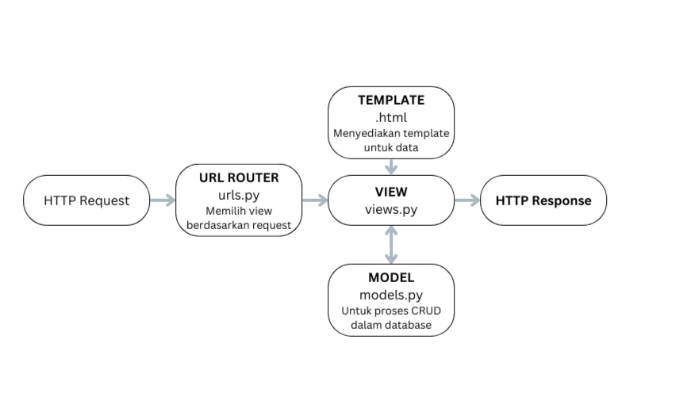

# Tugas 2 PBP
Link : https://shop-inventory-web.adaptable.app/

## Implementasi Checklist
Hal yang pertama kali saya lakukan untuk membuat project Django adalah membuat sebuah directory baru bernama [shop_inventory](https://github.com/Itqonibras/shop-inventory) dan menginisiasi proyek menggunakan terminal. Selanjutnya saya menambahkan *dependencies* yang diperlukan dan mengaitkan *local repository* ke github *repository*. Langkah selanjutnya yang saya lakukan adalah membuat aplikasi main menggunakan terminal dan menambahkannya kedalam berkas 'settings.py'. Dilanjut dengan membuat template 'main.html' yang berisi judul web dan juga tabel yang memiliki atribut name, description, dan amount serta tidak lupa saya juga membuat model untuk atribut tersebut. Saya melakukan migrasi terhadap model yang telah dibuat menggunakan terminal dan juga membuat *function* pada 'views.py' agar template yang telah saya buat dapat ditampilkan. Untuk mengarahkan *function* yang telah saya buat ke 'views.py', saya melakukan routing melalui berkas 'urls.py' dan juga memasukkan routing ke 'urls.py' yang terletak pada direktori proyek. Terakhir saya mengupdate github *repository* saya dan melakukan deploy pada [adaptable.io](https://adaptable.io).

## Bagan Serta Keterkaitan antar Berkas

- urls.py memiliki fungsi untuk memilih tampilan (view) berdasarkan request user
- models.py memiliki fungsi untuk menghubungkan database dan view saat mengolah data
- views.py memiliki fungsi untuk melakukan logika bisnis yang dibantu oleh model dan template
- berkas HTML memiliki fungsi untuk menampilkan data-data yang dimiliki

## Virtual Environment
Virtual environment digunakan untuk medapatkan membatasi atau mengisolasi *package* dan *dependencies* yang terdapat pada suatu aplikasi. Kita bisa saja membuat suatu aplikasi Django tanpa virtual environment, akan tetapi hal tersebut dapat menyebabkan konflik suatu *package* dengan *package* lainnya dengan versi yang berbeda yang terdapat pada komputer kita.

## Perbedaan MVT, MVC,dan MVVM
Dalam dunia pengembangan web, terdapat istilah seperti MVC, MVT, dan MVVM. Ketiganya merupakan sebuah konsep arsitektur dalam pengembangan web untuk memisahkan komponen-komponen utama dari suatu aplikasi seperti logika bisnis, tampilan, dan interaksi pengguna. Konsep tersebut ditujukan untuk mempermudah proses dalam pengembangan web dan juga mempermudah proses testing.

Perbedaan dari ketiganya adalah:
- MVT (Model-View-Template)
    1. Pengguna mengakses satu URL tertentu.
    2. Django akan mencocokkan URL dengan pola yang sesuai dalam berkas urls.py dan menentukan View yang akan menangani permintaan tersebut.
    3. View menerima permintaan dan menjalankan logika bisnis yang dibutuhkan oleh aplikasi.
    4. Jika View memerlukan data dari basis data, View akan berkomunikasi melalui Model sebagai perantara.
    5. Setelah Model selesai memproses data dalam basis data, View akan menggunakan templat (HTML) untuk merender data tersebut ke dalam tampilan yang diinginkan.
    6. Setelah templat selesai mengatur tampilan, View akan menghasilkan halaman HTML yang telah dirender bersama dengan respons HTTP yang sesuai.
    7. Respons HTTP tersebut berisi halaman HTML yang diminta oleh pengguna.
- MVC (Model-View-Controller)
    1. user berinteraksi dengan view dengan melakukan suatu action.
    2. action kemudian diteruskan ke Controller, pada Controller action tersebut diproses sesuai kebutuhan aplikasi.
    3. Controller akan berinteraksi dengan Model untuk mengambil atau mengubah data pada Model.
    4. Setelah berinteraksi dengan Model, Controller akan  mengupdate data yang akan ditampilkan dan mengirimkan ke View.
    5. View menerima data dari Controller kemudian mengupdate tampilan interface.
- MVVM (Model-View-ViewModel)
    1. Pengguna berinteraksi dengan Tampilan melalui tindakan yang dilakukan.
    2. Tindakan yang diterima oleh Tampilan akan diteruskan ke Model Tampilan (ViewModel).
    3. ViewModel mengelola logika bisnis aplikasi dan berfungsi sebagai perantara antara Tampilan dan Model.
    4. Jika diperlukan untuk berinteraksi dengan basis data, Model akan melakukan interaksi tersebut.
    5. Setelah data dari basis data diperoleh, Model akan meneruskannya ke ViewModel.
    6. Kemudian, ViewModel akan menjalankan proses yang dibutuhkan oleh aplikasi pada data yang diterima sebelum mengirimkannya kembali ke Tampilan.
    7. Setelah data yang telah diproses diteruskan ke Tampilan, Tampilan akan melakukan pengaturan tampilan sesuai dengan kebutuhan.
    8. Setelah itu, pengguna dapat melihat tampilan yang telah diperbarui dan siap untuk melakukan interaksi selanjutnya.

